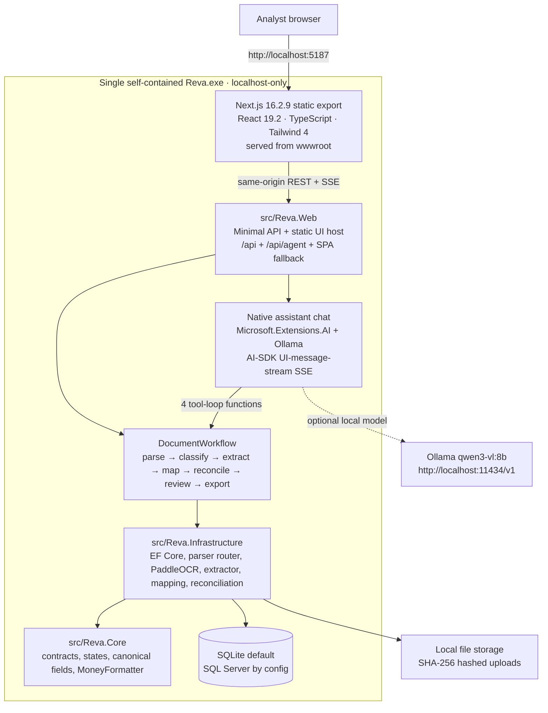

<div align="center">
  

  

  <h1>Reva</h1>
  <p><strong>Offline-by-default bordereaux ingestion, reconciliation, review, and export in one Windows executable.</strong></p>

  

  <p>
    <a href="https://github.com/xt0n1-t3ch/Reva/actions/workflows/ci.yml"></a>
    
    
    
    
    
    
    
    
    
    <a href="CHANGELOG.md"></a>
    <a href="LICENSE"></a>
  </p>
</div>

Reva is a local-first, offline-by-default AI document-intelligence application for reinsurance bordereaux ingestion and reconciliation. It turns messy files, emails, spreadsheets, PDFs, scans, and visible text into structured, reviewable, export-ready data with source citations, honest confidence, learned schema mapping, and analyst corrections that persist by sender.

The shipped product is a single self-contained `Reva.exe`. It serves the static Next.js cockpit, REST API, OCR, reconciliation engine, and native assistant chat from one localhost origin: `http://localhost:5187`. No Node.js, web server, cloud OCR, or API key is required at run time.

## Highlights

| Capability | What Reva does |
|:---|:---|
| Any-format intake | Ingests TXT, Markdown, CSV, Office files, `.eml`/`.msg` email with attachments, digital PDFs, images, scanned PDFs, and unknown binaries through a low-confidence visible-text fallback. |
| Offline OCR | Runs bundled `Sdcb.PaddleOCR` PP-OCR V5 models locally and records normalized boxes and polygons for citation overlays. |
| Native assistant | Streams AI-SDK UI-message SSE from `/api/agent` while `Microsoft.Extensions.AI` talks to a local Ollama OpenAI-compatible endpoint. |
| Learned schema mapping | Combines static reinsurance aliases, bounded fuzzy matching, and EF-backed sender/domain overrides learned from analyst corrections. |
| Reconciliation | Compares stated headline figures to computed table totals for money fields, cession rate, and line of business with a configurable tolerance. |
| Rossum-style review | Shows document pages beside fields; hovering a field highlights the exact cited source region and scales with zoom. |
| Export templates | Exports CSV, Excel, and JSON through saved templates, including a Lloyd's CRS template and live preview. |
| Local-first default | Keeps extraction deterministic and keyless; optional LLM-assisted extraction and optional Docling paths stay disabled unless configured. |

## Architecture at a glance



## Quick start

### Windows release

1. Download `Reva-v1.3.0-win-x64.zip` from [Releases](https://github.com/xt0n1-t3ch/Reva/releases).
2. Extract the ZIP.
3. Double-click `Reva.exe` or `Start-Reva.cmd`.
4. Open `http://localhost:5187` and upload a reinsurance document.

Optional assistant chat:

```powershell
winget install Ollama.Ollama
ollama pull qwen3-vl:8b
```

Reva best-effort starts `ollama serve` when Ollama is installed. If the model is unavailable, chat reports that clearly and the rest of the product continues to work offline.

### From source

```powershell
dotnet run --project src/Reva.Web/Reva.Web.csproj
```

For frontend development:

```powershell
cd web
pnpm install
pnpm dev
```

Core validation:

```powershell
dotnet test Reva.slnx
cd web
npx playwright test
```

## Repository map

| Path | Owns |
|:---|:---|
| [`src/Reva.Core`](src/Reva.Core/) | Domain contracts, document states, canonical reinsurance field names, and shared money formatting. |
| [`src/Reva.Infrastructure`](src/Reva.Infrastructure/) | Persistence, storage, hashing, parsers, OCR, classification, extraction, learned mapping, reconciliation, workflow orchestration, and native agent services. |
| [`src/Reva.Web`](src/Reva.Web/) | .NET 10 web host, REST endpoints, `/api/agent`, OpenAPI, static UI serving, and SPA fallback. |
| [`web`](web/) | Next.js App Router cockpit that static-exports into `src/Reva.Web/wwwroot` at package time. |
| [`contracts`](contracts/) | Review payload schema, including normalized citation geometry. |
| [`tests`](tests/) | Unit, integration, host smoke, package smoke, and test index. |
| [`docs`](docs/) | Architecture, pipeline, packaging, demo, and reinsurance-domain documentation. |

## Documentation

| Guide | Start here when you want to... |
|:---|:---|
| [Documentation index](docs/index.md) | Navigate the project docs. |
| [Architecture](docs/architecture.md) | Understand the all-in-one executable, backend boundaries, API host, static UI, data model, and security posture. |
| [AI pipeline](docs/ai-pipeline.md) | Follow parsing, OCR, extraction, schema mapping, reconciliation, assistant chat, and export flow. |
| [Packaging](docs/packaging.md) | Build and smoke-test `Reva-v1.3.0-win-x64.zip`. |
| [Demo script](docs/demo-script.md) | Run a concise product walkthrough with the seeded corpus. |
| [Reinsurance landscape](docs/research/reinsurance-landscape.md) | Review the document types, canonical fields, standards, and competitive UX patterns behind Reva. |
| [Test suite](tests/index.md) | Pick the right unit, integration, E2E, Playwright, or package-smoke command. |
| [Visual reference](docs/visual-references/reva-intelligence-cockpit-reference.png) | See the current cockpit direction. |

<details>
<summary><strong>Runtime contract</strong></summary>

- `POST /api/documents` uploads a file and starts the workflow.
- `GET /api/documents` and `GET /api/documents/{id}` return queue/detail data.
- `GET /api/documents/{id}/review-payload` returns the schema-backed review payload.
- `GET /api/documents/{id}/pages/{page}.png` serves renderable page images for the split view.
- `POST /api/documents/{id}/review` saves field edits and mapping corrections.
- `GET /api/documents/{id}/export` downloads CSV, Excel, or JSON.
- `/api/templates` owns export template CRUD and duplication.
- `POST /api/data/reseed` and `POST /api/data/clear` manage demo/workspace data.
- `POST /api/agent` streams AI-SDK UI-message-stream SSE.
- `GET /api/agent/status` reports local Ollama/model readiness.
- `GET /health` reports package health.

</details>

<details>
<summary><strong>Offline defaults</strong></summary>

Reva's keyless path is the product default: native .NET parsers, local PaddleOCR, SQLite, deterministic extraction, learned mapping, reconciliation, review, and exports all run without a cloud account. Optional Docling and optional LLM-assisted extraction are additive configuration paths, not required runtime services.

</details>

## License

MIT — see [LICENSE](LICENSE).
