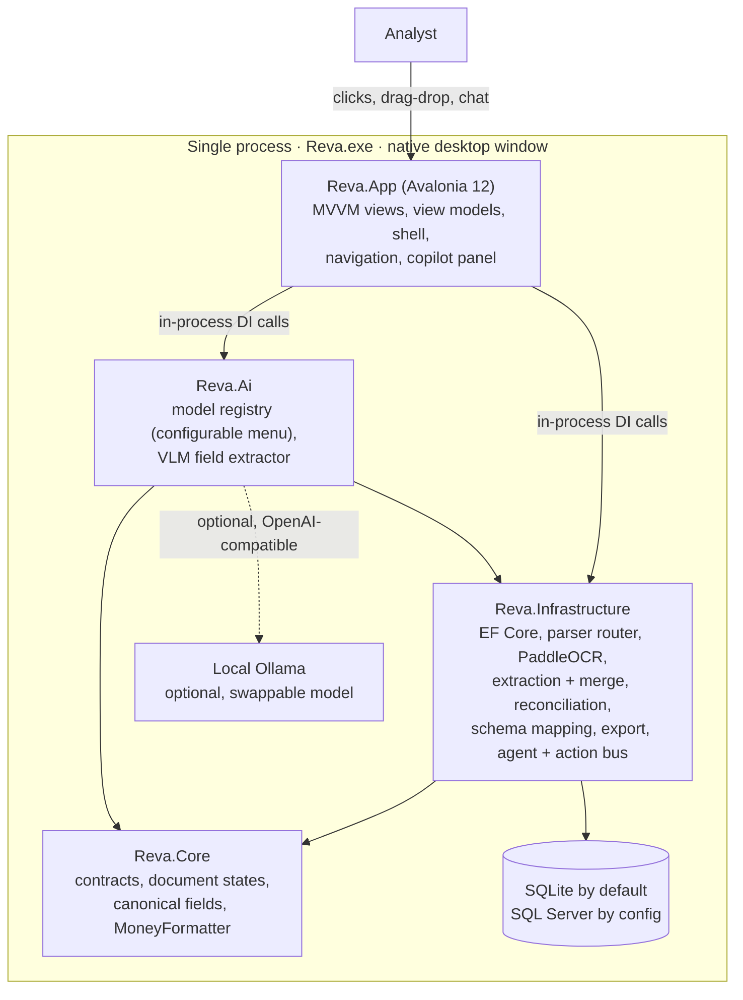
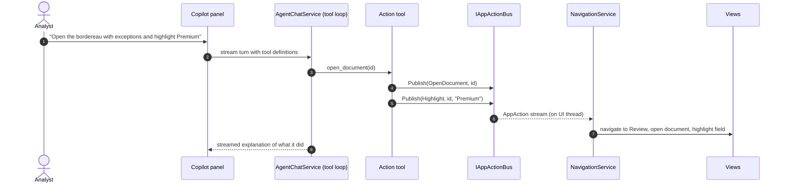

<div align="center">
  

  <h1>Reva</h1>
  <p><strong>A native desktop app that turns messy reinsurance documents into reviewable, source-cited, export-ready data — fully offline by default.</strong></p>

  <p>
    
    
    
    
    
    
    <a href="LICENSE"></a>
  </p>
</div>

Reva ingests the documents a reinsurance back office actually receives — emails with attachments, spreadsheets, digital and scanned PDFs, Word and PowerPoint files, plain text, and the occasional unknown binary — and produces structured, reviewable records. Every extracted value carries a citation back to the page region it came from. Headline figures are reconciled against the line items that should add up to them. Analyst corrections are learned per sender so the next document from the same broker maps itself.

Reva 2.0 is a **native Avalonia desktop application**. You download or build one file, `Reva.exe`, and double-click it. It opens a real desktop window — not a browser, not a localhost server, not a separate web process. The UI, the document pipeline, the database, the OCR engine, and the AI copilot all run in a single process and talk to each other through in-process method calls.

## What changed in 2.0

The previous release shipped a .NET host that served a Next.js cockpit over `http://localhost:5187`. Reva 2.0 retires that browser stack for the end user. The application is now a native window built on Avalonia, with the same proven domain core underneath. Three things drive the new version:

- **Native, not browser.** `Reva.App` is an Avalonia desktop client. No HTTP server, no port, no SPA. It calls the domain services directly through dependency injection.
- **VLM-first, configurable.** Extraction starts deterministic and keyless. On top of that, a vision-language model (VLM) running in your local Ollama can read page images and propose additional fields. The model is **chosen in Settings from a menu, not hardcoded.**
- **Agentic copilot.** A chat panel can answer questions about your documents and also *act* on the app — navigate, open a document, correct a field, set a review state, export — by driving the same UI you do.

## The three-tier processing model

Reva separates "always works" from "works better with a model" from "works better with extra tooling." Each tier is independent; a missing tier never breaks the one below it.

| Tier | What it does | Requires |
|:---|:---|:---|
| **1 — Deterministic (always on)** | Native parsers, bundled offline PaddleOCR, rule-based reinsurance field extraction, schema mapping, and reconciliation. This tier runs with no model and no network. | Nothing. Ships in the box. |
| **2 — Local VLM (swappable)** | A vision-language model reads the rendered page images and proposes fields the deterministic tier missed, each with a citation. Proposals are merged conservatively — they never overwrite a validated money total. | A local Ollama and a pulled model, both optional. Enabled with the **LLM assist** toggle in Settings. |
| **3 — Docling (optional)** | A richer document-layout parsing path for hard PDFs and scans, run through an external Docling worker when explicitly installed and enabled. | Python + Docling, off by default. |

If Ollama is not running, or no model is pulled, Reva still ingests, extracts, reconciles, reviews, and exports. The model makes things better; it is never a hard dependency.

## The configurable model menu

The VLM is a setting, not a constant. The model menu in **Settings** lists a curated set of capable June-2026 local models plus anything you have already pulled into Ollama. Pick one; it is persisted and used for both the copilot and VLM-assisted extraction.

| Model | Kind | Note |
|:---|:---|:---|
| Qwen 3.5 | vision | Newest Qwen, multimodal — recommended if pulled |
| Qwen3-VL | vision | Strong document VLM |
| Qwen3-VL 8B | vision | Balanced local VLM (the default if present) |
| Granite Docling | vision / OCR | IBM's small document VLM |
| Llama 4 | text | General text model |
| Gemma 4 | text | General text model |

Reva probes Ollama's `/api/tags`, marks which curated models are installed, and appends any other models it finds. The full June-2026 landscape — why these models, where PaddleOCR-VL, MinerU, and granite-docling fit, and why none of it is wired as a constant — is in [docs/learn/model-landscape.md](docs/learn/model-landscape.md).

## File-type coverage

Routing is by sniffed content and parser capability, not by extension alone. Anything unrecognized degrades to a low-confidence visible-text record instead of failing.

| Input | Handled by |
|:---|:---|
| TXT, Markdown, CSV | Built-in text/CSV parsers with encoding detection |
| DOCX, PPTX | `DocumentFormat.OpenXml` |
| XLSX, XLS, ODS | `ClosedXML`, legacy Excel reader, OpenDocument reader |
| EML, MSG | `MimeKit` and `MSGReader`, including recursive attachments |
| Digital PDF | `PdfPig` |
| Images, scanned PDF | `Sdcb.PaddleOCR` (PP-OCR V5, bundled) with page rendering |
| Unknown / binary | Best-effort visible-text fallback, never a hard error |

## Quick start

### Run the release

1. Download `Reva.exe` (the single self-contained Windows build) from Releases.
2. Double-click `Reva.exe`. A native window opens — there is no URL to visit.
3. Drag a reinsurance document onto the upload area, or click to browse.

Your workspace (database and uploaded files) lives under `%LOCALAPPDATA%\Reva`. Nothing leaves the machine.

### Enable the AI copilot and VLM (optional)

```powershell
winget install Ollama.Ollama
ollama pull qwen3-vl:8b
```

Open **Settings**, choose a model from the menu, and turn on **LLM assist** if you want VLM-assisted extraction. The status dot in the shell turns green when Ollama is reachable.

### Build and run from source

```powershell
dotnet run --project src/Reva.App/Reva.App.csproj
```

This launches the native window directly. For the full validator chain, see [AGENTS.md](AGENTS.md) and [tests](tests/).

## Architecture at a glance

Everything runs in one process. The layers depend inward only, and there is no HTTP between them.



### How the copilot acts on the app

The copilot does not script the UI through a back door. Its action tools publish typed `AppAction` messages onto an in-process `IAppActionBus`. The app's `NavigationService` subscribes to that bus and moves the real UI. The chat and the UI stay in lockstep because they share one channel.



## Repository map

| Path | Owns |
|:---|:---|
| [`src/Reva.Core`](src/Reva.Core/) | Domain contracts, document states, canonical reinsurance field names, and money formatting. No UI, no infrastructure. |
| [`src/Reva.Infrastructure`](src/Reva.Infrastructure/) | EF Core persistence, file storage, hashing, parser routing, PaddleOCR, extraction and merge, reconciliation, schema mapping, export, settings, the agent chat service, and the in-process action bus. |
| [`src/Reva.Ai`](src/Reva.Ai/) | The configurable model registry and the VLM field extractor. The seam where models plug in. |
| [`src/Reva.App`](src/Reva.App/) | The Avalonia desktop application — the shipped `Reva.exe`. Views, view models, navigation, the copilot panel, theming, and DI composition. |
| [`src/Reva.Web`](src/Reva.Web/) | The legacy browser host. Retained, not part of the 2.0 product. |
| [`contracts`](contracts/) | Review payload schema, including normalized citation geometry. |
| [`docs`](docs/) | Architecture, AI pipeline, packaging, and the learning guides in [`docs/learn`](docs/learn/). |
| [`tests`](tests/) | Unit and integration suites. |

## Documentation

Start at the [documentation index](docs/index.md). For interview-style depth on how and why Reva is built the way it is, the [learning guides](docs/learn/) walk through every project, every technology choice, and the questions an interviewer is likely to ask.

## License

MIT — see [LICENSE](LICENSE).
