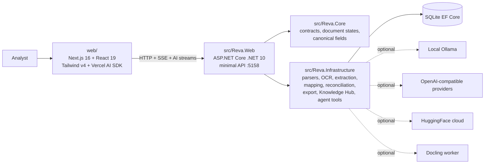

<div align="center">
  

  <h1>Reva</h1>
  <p><strong>A web app for reinsurance document intelligence: ingest, extract, cite, reconcile, review, and export.</strong></p>

  <p>
    
    
    
    
    
    
    <a href="LICENSE"></a>
  </p>
</div>

Reva turns the files a reinsurance operations team receives into structured, reviewable data. It handles bordereaux, statements of account, slips, loss runs, claim notices, endorsements, spreadsheets, emails, scanned images, and PDFs. Every extracted value carries provenance. When page geometry is available, the review view can point back to the exact source region.

The product is one web app: a Next.js 16 + React 19 + Tailwind v4 frontend in `web/`, backed by an ASP.NET Core .NET 10 minimal API in `src/Reva.Web` on port `5158`. The domain core lives in `src/Reva.Core`; parsing, OCR, extraction, reconciliation, persistence, export, Knowledge Hub, and agent tooling live in `src/Reva.Infrastructure`. SQLite EF Core is the default store.

## What Reva shows in an interview

- **Any-format intake.** PDF, XLSX, XLS, ODS, CSV, TSV, DOCX, PPTX, EML, MSG, PNG, and JPG route through format-aware parsers. Scans use local PaddleOCR.
- **Deterministic first.** Label regexes, CSV/header mapping, table parsing, and reconciliation work without keys or model access.
- **Optional model assist.** Local Ollama, OpenAI-compatible endpoints, and HuggingFace-backed providers can assist extraction or chat when enabled.
- **Source-cited review.** Fields show confidence, provenance, citations, and reconciliation exceptions before export.
- **Agentic copilot.** A friendly-name agent can list documents, explain fields, open records, correct values, change review state, export, and search the Knowledge Hub through tools.
- **Knowledge Hub.** Reference material and project notes are searchable from the same analyst workspace.
- **Real-time processing stream.** The UI can subscribe to document-processing events and show the pipeline as it scans, extracts, maps, and reconciles.

The chat surface is a modern agentic stack built on the Vercel AI SDK and an OpenAI-compatible streaming protocol, the same class of tooling used by leading AI products. Reva does not brand the product as any one assistant or hosted model.

## Processing model

| Layer | What it does | Default |
|:---|:---|:---|
| Deterministic pipeline | Parse, OCR, classify, extract canonical fields, map sender headers, reconcile totals, persist citations, export templates. | On |
| Local model assist | Uses a selected local model for extra extraction or agent reasoning. | Off |
| OpenAI-compatible providers | Streams chat and tool calls through provider-neutral endpoints when configured. | Off |
| HuggingFace cloud | Optional remote inference path for experiments or stronger models. | Off |
| Docling worker | Optional layout parser for hard documents. | Off |

Missing optional providers never break upload, review, reconciliation, or export.

## Quick start

Run the API:

```powershell
dotnet run --project src/Reva.Web/Reva.Web.csproj -- --no-open
```

Run the web app:

```powershell
cd web
$env:NEXT_PUBLIC_API_BASE_URL = "http://localhost:5158"
pnpm install
pnpm dev
```

Open `http://localhost:3000`. Upload a reinsurance document, review extracted fields with citations, reconcile totals, ask the copilot what happened, then export CSV, Excel, or JSON.

Optional local model path:

```powershell
winget install Ollama.Ollama
ollama pull qwen3-vl:8b
```

Enable model assist in Settings only when a provider is reachable. The deterministic path stays usable without it.

## Architecture at a glance



## Repository map

| Path | Owns |
|:---|:---|
| `web/` | Product frontend: app shell, review workspace, Knowledge Hub, copilot, API client contract in `web/lib/api/client.ts`. |
| `src/Reva.Web/` | ASP.NET Core API, endpoint groups, streaming surfaces, static export host. |
| `src/Reva.Core/` | Domain contracts, document states, canonical reinsurance fields, money formatting. |
| `src/Reva.Infrastructure/` | Persistence, storage, parsers, PaddleOCR, extraction, reconciliation, schema mapping, export, settings, agent tools, Knowledge Hub. |
| `contracts/` | Review payload schema and normalized citation geometry. |
| `docs/` | Architecture, pipeline, packaging, research, and interview learning notes. |
| `tests/` | Unit, integration, and end-to-end test projects. |

## Documentation

Start at [docs/index.md](docs/index.md). For interview prep, read [docs/learn/interview-cheatsheet.md](docs/learn/interview-cheatsheet.md), then [docs/learn/code-tour.md](docs/learn/code-tour.md).

## License

MIT. See [LICENSE](LICENSE).
