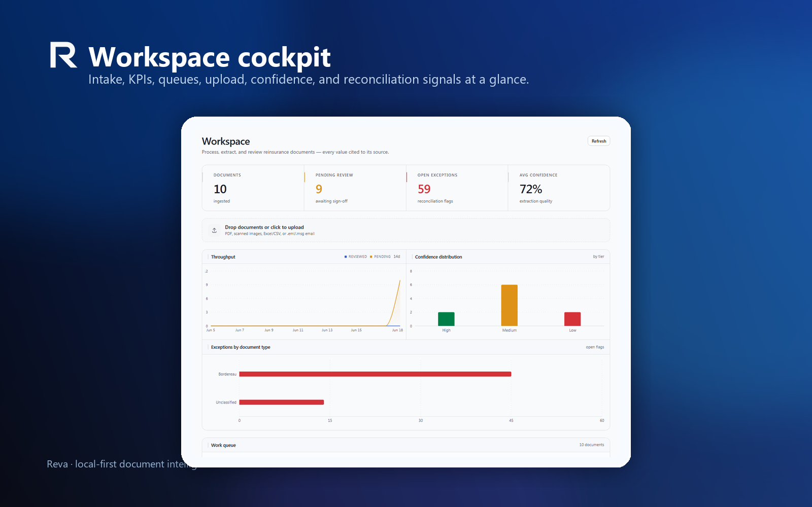
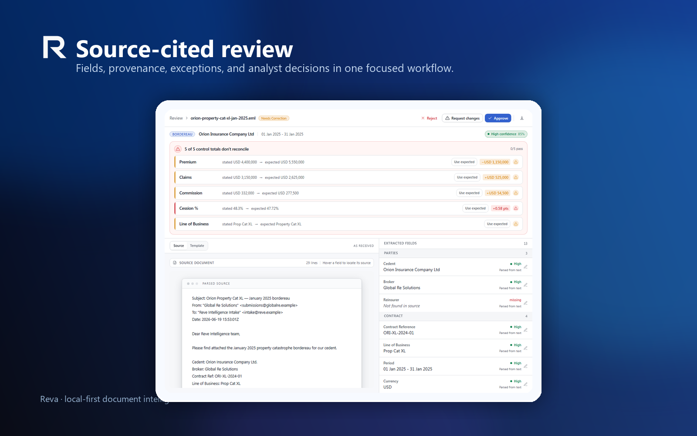
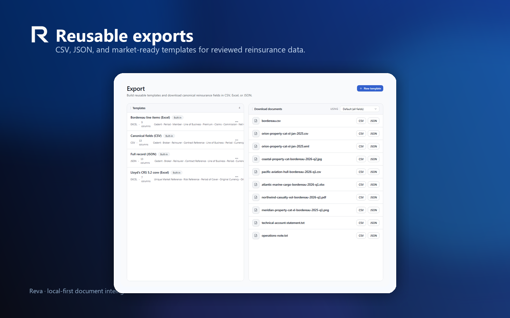
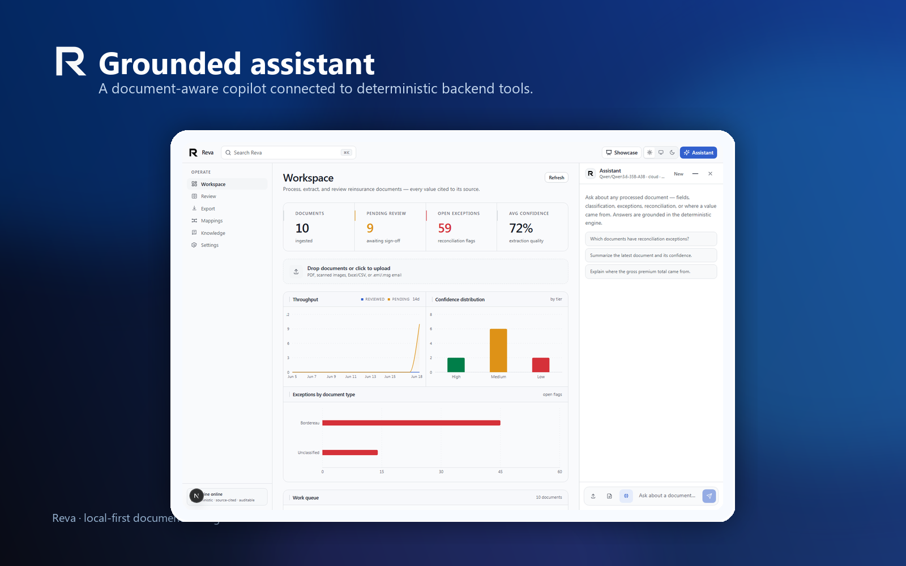
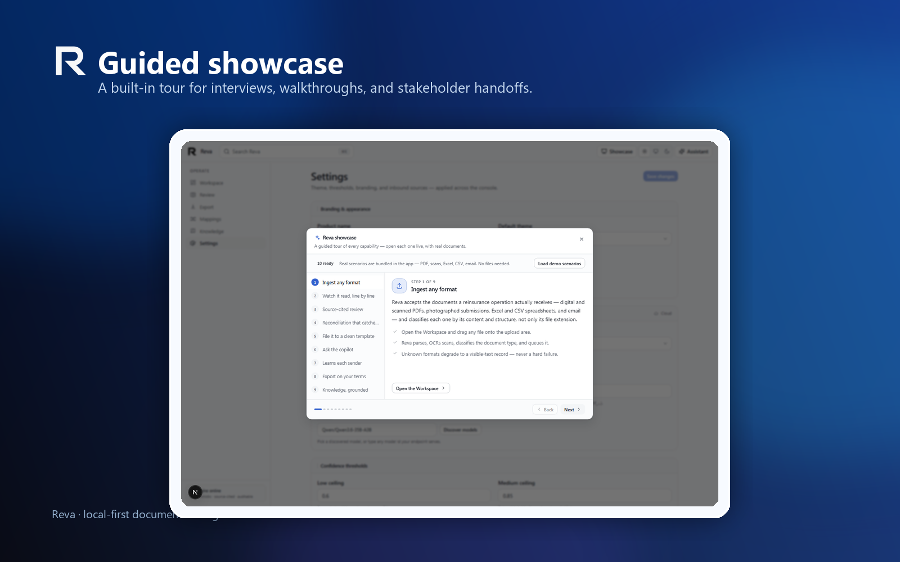
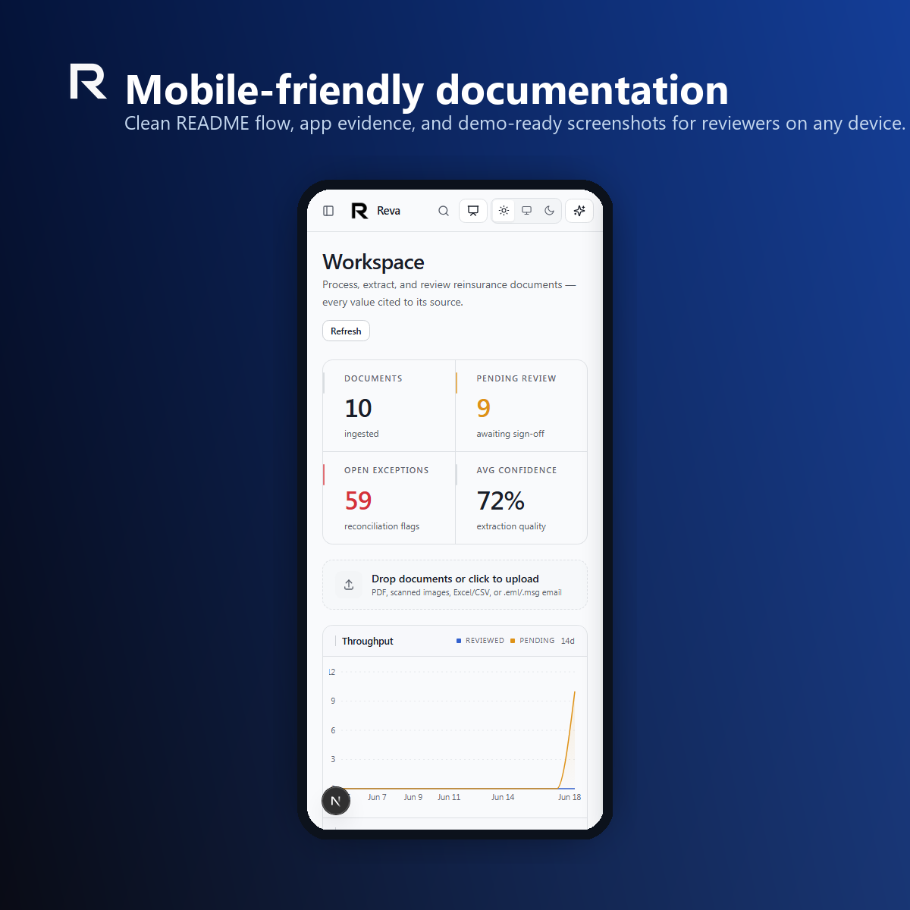

<div align="center">
  <picture>
    <source media="(prefers-color-scheme: dark)" srcset="docs/assets/reva-logo-light.png">
    
  </picture>

  <h1>Reva</h1>

  <p><strong>Local-first document intelligence for reinsurance operations.</strong></p>
  <p>Ingest messy submissions, extract source-cited data, reconcile control totals, review exceptions, and export clean records from one analyst workspace.</p>

  <p>
    <a href="https://github.com/xt0n1-t3ch/Reva/actions/workflows/ci.yml"></a>
    
    
    
    
    
    
  </p>
</div>

---

## What Reva does

Reva is built for the document flow between cedents, brokers, and reinsurers. Those teams receive spreadsheets, PDFs, scanned images, emails, bordereaux, statements, slips, loss runs, and claim notices. Reva turns that inbound noise into reviewable data with evidence attached.

In plain English:

1. **Drop in the files.** Reva accepts common office, email, image, spreadsheet, text, and PDF formats.
2. **It reads and classifies them.** Digital documents are parsed directly; scanned documents use local OCR.
3. **It extracts the important fields.** Cedent, broker, reinsurer, period, currency, premium, claims, commission, cession percentage, retention, limit, and contract references are normalized.
4. **It proves where values came from.** Every value carries provenance, and geometry-backed citations can point back to the source area.
5. **It checks the money.** Control totals are compared against line-item totals under a configurable tolerance.
6. **It lets an analyst decide.** Exceptions, confidence, citations, and suggested corrections are reviewed before export.
7. **It exports clean records.** Data can leave as CSV, Excel, or JSON using reusable templates.

The important product decision: **the default workflow is deterministic and keyless**. AI providers can assist when configured, but upload, extraction, reconciliation, review, and export do not depend on a hosted model.

## Showcase

<p align="center">
  
</p>

<p align="center">
  
</p>

<p align="center">
  
</p>

<p align="center">
  
</p>

<p align="center">
  
</p>

<p align="center">
  
</p>

## Capabilities at a glance

| Capability | What it means for a non-programmer | Why it matters |
|:---|:---|:---|
| Any-format intake | Reva can accept the file types a real operations inbox receives. | Less manual file cleanup before review. |
| Local OCR | Scans and photographed tables can still become searchable text. | Paper and image submissions do not become dead ends. |
| Source-cited fields | Values can point back to the original document text or region. | Reviewers can trust but verify quickly. |
| Reconciliation | Stated totals are checked against computed line-item totals. | Financial breaks are visible before data leaves the system. |
| Learned mappings | Sender-specific column names can be remembered after correction. | The second file from the same sender is faster than the first. |
| Knowledge Hub | Product and domain notes are searchable inside the analyst workspace. | The assistant can answer with project context instead of guessing. |
| Export templates | Data leaves in the shape the market or downstream team expects. | Review work turns into usable operational output. |

## How the system fits together

| Layer | Responsibility |
|:---|:---|
| `web/` | The analyst application: workspace, review, export, mappings, settings, Knowledge Hub, and assistant. |
| `src/Reva.Web/` | The ASP.NET Core host: HTTP API, streaming endpoints, agent endpoint, and production static-file serving. |
| `src/Reva.Core/` | The shared reinsurance vocabulary: document states, canonical fields, contracts, and value formatting. |
| `src/Reva.Infrastructure/` | The document machinery: storage, parsing, OCR, extraction, mapping, reconciliation, export, settings, and agent tools. |
| `contracts/` | Stable JSON schemas for review payloads and citation geometry. |
| `docs/` | Product, architecture, demo, packaging, interview, and learning documentation. |

The runtime path is simple: **analyst browser → Next.js app → ASP.NET Core API → deterministic workflow → SQLite storage → review/export**. Optional model providers attach through settings and never replace the deterministic source of truth.

## Quick start

### 1. Run the API

```powershell
dotnet run --project src/Reva.Web/Reva.Web.csproj -- --no-open
```

### 2. Run the web app

```powershell
cd web
$env:NEXT_PUBLIC_API_BASE_URL = "http://localhost:5158"
pnpm install
pnpm dev
```

Open `http://localhost:3000`.

### 3. Try the demo flow

1. Open **Workspace** and load demo scenarios or upload a document.
2. Open **Review** and inspect fields, citations, confidence, and exceptions.
3. Ask **Assistant** which documents need review or where a value came from.
4. Open **Mappings** to see sender-specific header normalization.
5. Open **Export** and download CSV or JSON.
6. Open **Showcase** for the guided product tour.

## Production packaging

Reva packages as a single ASP.NET Core host that can serve both the API and the exported frontend. The Windows packaging script builds the static web app, copies it into the API host, publishes `Reva.exe`, and smoke-tests the package against real HTTP routes.

See [docs/packaging.md](docs/packaging.md) for the exact shape.

## Documentation

| Page | Purpose |
|:---|:---|
| [Product guide](docs/product-guide.md) | Plain-English explanation of the workflow and value. |
| [Architecture](docs/architecture.md) | System boundaries, data flow, and extension points. |
| [AI and pipeline](docs/ai-pipeline.md) | Deterministic workflow, optional model assist, and agent tools. |
| [Demo script](docs/demo-script.md) | Interview-ready walkthrough and talk track. |
| [Packaging](docs/packaging.md) | Development and Windows release shape. |
| [Interview cheatsheet](docs/learn/interview-cheatsheet.md) | Questions, answers, and concise selling points. |
| [Code tour](docs/learn/code-tour.md) | Where to look in the repository. |
| [Tech stack](docs/learn/tech-stack.md) | How to explain each technology choice. |
| [Model landscape](docs/learn/model-landscape.md) | Local and hosted model-provider options. |

## Validation

```powershell
dotnet build Reva.slnx -warnaserror
dotnet test
```

For UI-facing changes, run the API and web app, then verify the browser flow live.

## License

MIT. See [LICENSE](LICENSE).
