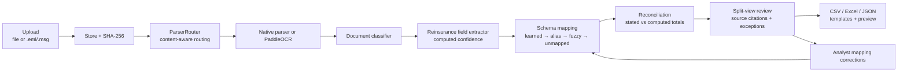
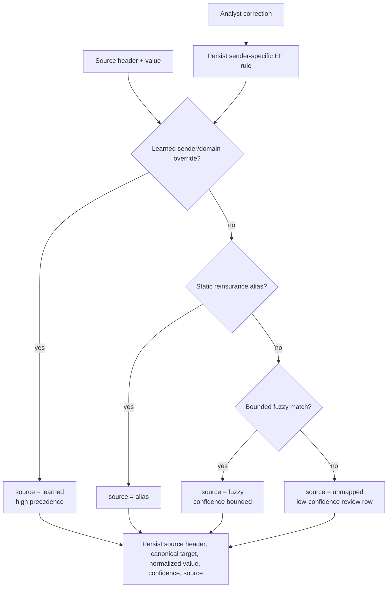

# AI pipeline

Reva's intelligence pipeline is local-first and keyless by default. Native parsers, bundled OCR, deterministic extraction, learned schema mapping, reconciliation, review, and export all run inside the .NET host. Optional Docling and optional LLM-assisted extraction are additive paths, not the core.

## Pipeline overview

## Intake and parser routing

`DocumentWorkflow` stores the upload, hashes it, and passes the file through `ParserRouter`. Routing is based on sniffed content and parser capability, not extension alone.

| Input | Runtime parser |
|:---|:---|
| TXT / Markdown / CSV | Built-in parser with encoding detection. |
| DOCX / PPTX | `DocumentFormat.OpenXml`. |
| XLSX | `ClosedXML`. |
| EML | `MimeKit`, including body and recursive attachments. |
| MSG | `MSGReader`. |
| Digital PDF | `PdfPig`. |
| Images / scanned PDFs | `Sdcb.PaddleOCR` with bundled PP-OCR V5 models. |
| Unknown / binary | Best-effort visible-text fallback, low confidence, never a workflow error. |
| Optional richer path | Python + Docling only when explicitly installed and enabled. |

## OCR and geometry

The OCR path runs entirely on the machine:

- No Python, cloud account, or OCR API key is required.
- Scanned PDFs are rasterized page by page and fed to the same PaddleOCR engine used for images.
- The parser captures per-line text, confidence, normalized bounding boxes, and polygons.
- Review overlays use the normalized geometry to highlight source regions as the user hovers or focuses fields.

## Extraction and confidence

The classifier and field extractor target technical accounts, bordereaux, and statements of account. Confidence is computed from how the value was located and blended with a domain validation check. Reva does not assign fixed confidence constants to make fields look better.

When an analyst corrects a field, the field becomes **Reviewed**. That is separate from machine confidence and keeps audit semantics honest.

## Schema mapping

Schema mapping turns sender-specific headers into Reva's canonical reinsurance fields.

Every mapping records source header, canonical target, normalized value, confidence, and source (`learned`, `alias`, `fuzzy`, or `unmapped`). Analyst corrections are persisted as sender-specific EF overrides and take precedence on the next document from that sender or email domain.

## Reconciliation

Reva reconciles documents that state headline figures and also carry line items. The engine compares detected stated values to computed expected values:

| Check | Detected | Expected |
|:---|:---|:---|
| Money fields | Stated premium, claims, commission, or balance. | Sum of the corresponding line-item column, with configurable tolerance. |
| Cession rate | Stated rate. | Line-item cession rate or computed share. |
| Line of business | Stated class/line. | Line-item class/line text, compared by token agreement. |

Each disagreement becomes a field-level exception with:

- field name;
- **Detected** value;
- **Expected** computed value;
- agreement score in `[0,1]`;
- reconciliation flag;
- tolerance used for money comparisons.

Nothing is hardcoded: figures and scores are derived from the document content.

## Native assistant chat

The assistant is native .NET and keeps the frontend transport unchanged:

- `POST /api/agent` streams AI-SDK UI-message-stream SSE.
- `@ai-sdk/react` `useChat` uses `DefaultChatTransport` against the same-origin endpoint.
- `Microsoft.Extensions.AI` and `Microsoft.Extensions.AI.OpenAI` talk to the local Ollama OpenAI-compatible endpoint at `http://localhost:11434/v1`.
- The default local model is `qwen3-vl:8b`.
- A dummy local key keeps the OpenAI-compatible client keyless.
- `GET /api/agent/status` reports whether Ollama is running and whether the model is present.
- The host best-effort auto-starts `ollama serve` when Ollama is installed.

A `FunctionInvokingChatClient` runs a bounded automatic tool loop over the real workflow:

| Tool | Purpose |
|:---|:---|
| `list_documents` | Summarize the current work queue. |
| `get_document` | Read a document's extracted fields and exceptions by id. |
| `reconcile` | Explain reconciliation checks and exceptions. |
| `explain_field` | Explain where a field value came from, including citations when available. |

If the local model is absent, chat degrades to a clear local-model-unavailable message. Ingestion, extraction, reconciliation, review, and export continue working.

## Export

Export supports CSV, Excel, and JSON. Templates have full CRUD, duplication, live preview, a default-template setting, and built-in shapes for canonical exports and Lloyd's CRS-oriented output.
