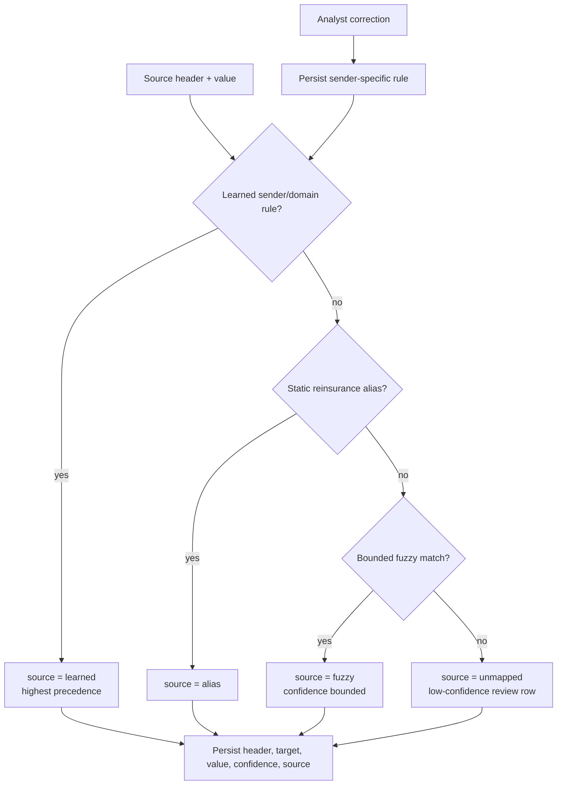

# AI pipeline

Reva's intelligence pipeline is local-first and layered into three independent tiers. Tier one is deterministic and always on. Tier two is an optional local vision-language model that proposes extra fields. Tier three is an optional Docling parser for hard layouts. Each tier degrades gracefully — a missing tier never breaks the one below it.

## Pipeline overview

```mermaid
flowchart LR
  Upload["Upload<br/>file or .eml/.msg"] --> Store["Store + SHA-256"]
  Store --> Route["ParserRouter<br/>content-aware routing"]
  Route --> Parse["Native parser / PaddleOCR / optional Docling"]
  Parse --> Classify["Classifier"]
  Classify --> Extract["Deterministic extractor (tier 1)<br/>computed confidence"]
  Extract --> Vlm{"LLM assist on?"}
  Vlm -->|yes| Propose["VLM proposal (tier 2)<br/>cited fields"]
  Vlm -->|no| Merge
  Propose --> Merge["Conservative merge"]
  Merge --> Map["Schema mapping<br/>learned → alias → fuzzy → unmapped"]
  Map --> Rec["Reconciliation<br/>stated vs computed totals"]
  Rec --> Review["Review<br/>source citations + exceptions"]
  Review --> Export["CSV / Excel / JSON templates"]
  Review --> Learn["Analyst mapping corrections"]
  Learn --> Map
```

## Tier 1 — deterministic, always on

This tier runs with no model and no network. It is the baseline every document gets.

### Intake and parser routing

`DocumentWorkflow.IngestAsync` stores the upload, hashes it with SHA-256, then passes it through `ParserRouter`. Routing is by sniffed content and parser capability, not extension alone. If a parser throws, the router falls back to a visible-text reader and records a warning — ingestion never crashes.

| Input | Runtime parser |
|:---|:---|
| TXT / Markdown / CSV | Built-in parser with encoding detection. |
| DOCX / PPTX | `DocumentFormat.OpenXml`. |
| XLSX / XLS / ODS | `ClosedXML`, legacy Excel reader, OpenDocument reader. |
| EML | `MimeKit`, including body and recursive attachments. |
| MSG | `MSGReader`. |
| Digital PDF | `PdfPig`. |
| Images / scanned PDF | `Sdcb.PaddleOCR` with bundled PP-OCR V5 models. |
| Unknown / binary | Best-effort visible-text fallback, low confidence, never an error. |

### OCR and geometry

OCR runs entirely on the machine — no Python, no cloud, no key. Scanned PDFs are rendered page by page and fed to the same PaddleOCR engine used for images. The parser captures per-line text, confidence, normalized bounding boxes, and polygons. Review overlays use that geometry to highlight the exact source region of each field, scaling with zoom.

### Deterministic extraction and confidence

The classifier targets technical accounts, bordereaux, and statements of account. The extractor locates each canonical field by rule and computes confidence from *how* the value was found, blended with a domain validation check. Reva never assigns flattering constants. When an analyst corrects a field, it becomes **Reviewed** — a human signal kept separate from machine confidence.

## Tier 2 — local VLM, optional and swappable

When **LLM assist** is enabled in Settings and a model is chosen, `DocumentWorkflow` asks `VlmFieldExtractor` (`src/Reva.Ai/VlmFieldExtractor.cs`) for a proposal after the deterministic pass.

The extractor collects up to eight rendered page images, builds a multimodal prompt — the system instruction, the rule to return strict JSON with a citation token, the canonical field list, and the deterministic fields already known — and sends it to the chosen vision model over Ollama's OpenAI-compatible endpoint at temperature 0. It validates every proposed field against the canonical names, clamps confidence, and enforces the citation token. Anything malformed is dropped; the whole call fails closed to `null`, so a model hiccup can never corrupt extraction. With no page images, it falls back to the parsed text.

### The conservative merge

`ExtractionMerger.Merge` (`src/Reva.Infrastructure/Extraction/LlmFieldExtraction.cs`) combines the proposal with the deterministic result under strict rules:

- A proposed field is accepted only if it has a value, confidence ≥ 0.6, and a citation.
- It never overwrites an already-populated money field (Premium, Claims, Commission, Retention, Limit).

This is why the model can add fields the rules missed without ever undermining a validated total.

### The model is configurable, not hardcoded

The vision model is chosen from a menu in Settings. `ModelRegistry` (`src/Reva.Ai/ModelRegistry.cs`) ships a curated June-2026 list, probes Ollama's `/api/tags` to mark which are installed, appends any other installed models, and persists the active choice. The same model drives both VLM extraction and the copilot. See [model landscape](learn/model-landscape.md) for the full picture.

## Tier 3 — optional Docling parser

For difficult PDFs and scans, an external Docling worker can produce richer layout parsing. It is off by default and enabled by configuration (`Features:Docling`). When present it slots into the parser stage; when absent the native parsers and PaddleOCR handle everything.

## Schema mapping

Schema mapping turns a sender's headers into canonical fields under a fixed precedence.

Analyst corrections persist as sender-specific rules and take precedence on the next document from that sender or email domain. Reva adapts without a training step.

## Reconciliation

Reva compares each stated headline figure (**Detected**) against the value computed from the line items (**Expected**), within a configurable money tolerance.

| Check | Detected | Expected |
|:---|:---|:---|
| Money fields | Stated premium, claims, commission, or balance. | Sum of the matching line-item column. |
| Cession rate | Stated rate. | Line-item cession rate or computed share. |
| Line of business | Stated class. | Line-item class, compared by token agreement. |

Each disagreement becomes a field-level exception carrying the field name, Detected, Expected, an agreement score in `[0,1]`, and the tolerance used. Figures and scores are derived from the document, never hardcoded.

## The copilot

The assistant is native .NET, built on `Microsoft.Extensions.AI` talking to the chosen model over Ollama's OpenAI-compatible endpoint. `AgentChatService` (`src/Reva.Infrastructure/Agent/AgentChatService.cs`) runs a bounded automatic tool loop over the real workflow.

**Read tools** answer questions over real data:

| Tool | Purpose |
|:---|:---|
| `list_documents` | Summarize the work queue. |
| `get_document` | Read a document's fields and exceptions. |
| `reconcile` | Explain reconciliation checks for a document. |
| `explain_field` | Explain where a field value came from, with citations. |

**Action tools** do work *and* drive the UI by publishing `AppAction`s onto the action bus:

| Tool | Effect |
|:---|:---|
| `goto` | Navigate to a screen. |
| `open_document` | Open a document in the review view. |
| `correct_field` | Correct a field and highlight it. |
| `set_review_state` | Approve, reject, or flag a document. |
| `export_document` | Export and open the export view. |
| `filter_queue` | Set the dashboard filter. |
| `process_documents` / `reseed` / `clear` | Refresh, reseed, or clear the workspace. |

Every tool is wrapped so a failure returns a clean error instead of breaking the turn. If no model is installed, chat degrades to a clear local-model-unavailable message and every other feature keeps working.

## Export

Export supports CSV, Excel, and JSON through reusable templates with full CRUD, duplication, live preview, a default-template setting, and built-in shapes including a Lloyd's CRS-oriented layout.
