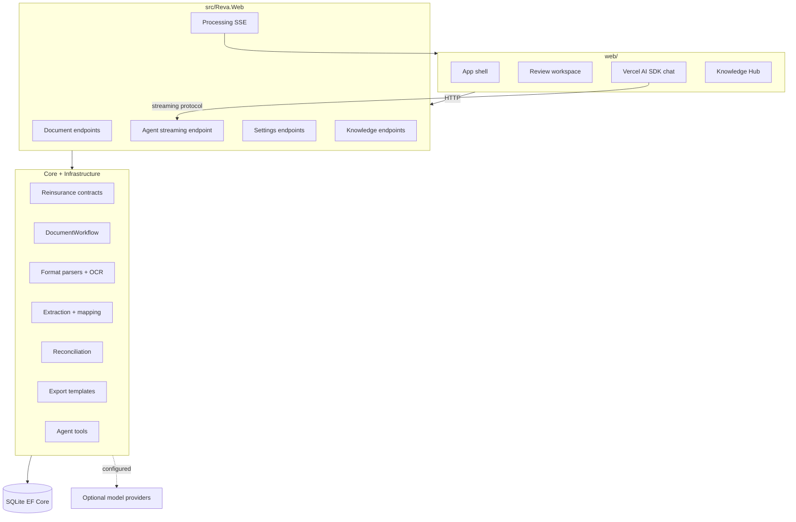

# Architecture

Reva is a web app backed by a .NET document-intelligence API. The frontend gives analysts a review workspace; the backend owns ingestion, OCR, extraction, reconciliation, persistence, export, Knowledge Hub, and agent tools.

## Runtime shape

- `web/` is the product frontend: Next.js 16, React 19, Tailwind v4, Vercel AI SDK, and a Geist-style design system.
- `src/Reva.Web` is the ASP.NET Core .NET 10 host. It maps feature endpoints once and serves the static export in production.
- `src/Reva.Core` owns domain contracts, document states, canonical field names, and shared value formatting.
- `src/Reva.Infrastructure` owns the workflow machinery: storage, EF Core, parser routing, PaddleOCR, field extraction, schema mapping, reconciliation, Knowledge Hub, export, settings, and agent tools.
- SQLite is the default EF Core provider. SQL Server remains a provider option by configuration.

## Request boundaries

| Boundary | Owner | Notes |
|:---|:---|:---|
| Frontend API client | `web/lib/api/client.ts` | Keep request/response shapes centralized here. |
| HTTP endpoints | `src/Reva.Web/Endpoints` | Map each endpoint group once. |
| Domain contracts | `src/Reva.Core` | Keep canonical field names and review payloads stable. |
| Workflow operations | `src/Reva.Infrastructure` | Deterministic path first; optional providers only when enabled. |
| Contract schemas | `contracts/` | Review payload schema and normalized geometry. |

## Data flow

1. Analyst uploads a document from the web app.
2. API stores the file, hashes it for deduplication, and starts the workflow.
3. Parser routing reads the format; scanned images use PaddleOCR.
4. Extraction finds canonical reinsurance fields and source spans.
5. Schema mapping normalizes sender headers.
6. Reconciliation compares stated totals to computed line-item values.
7. Review payloads return fields, citations, issues, and export options.
8. The agent can call backend tools over the same persisted state.

## Provider model

Model providers are optional. The default path is deterministic. When configured, Reva can use local Ollama, OpenAI-compatible streaming endpoints, or HuggingFace cloud paths for chat and extraction assist.
