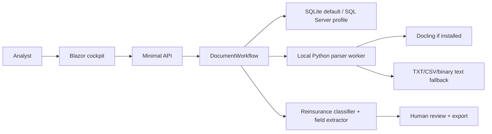

# Architecture

Reva is a backend-first Blazor Web App for reinsurance document operations. The backend owns contracts, persistence, parsing, classification, extraction, review decisions, and exports. The frontend consumes the same API that tests exercise.

## System shape



## Boundaries

- `contracts/` defines public payload shape.
- `src/Reva.Core` holds domain contracts, document states, and reinsurance terms.
- `src/Reva.Infrastructure` owns EF Core persistence, file storage, hashing, parser invocation, classification, extraction, and workflow orchestration.
- `src/Reva.Web` owns the API and Blazor cockpit.
- `tools/docling-worker` is the local parser worker. It can use Docling when installed and has deterministic fallback paths for demo reliability.

## Database

SQLite is the default so the repo runs with no infrastructure. SQL Server is selected by configuration:

```json
{
  "Reva": {
    "Database": {
      "Provider": "SqlServer",
      "ConnectionString": "Server=.;Database=Reva;Trusted_Connection=True;TrustServerCertificate=True"
    }
  }
}
```

## Reinsurance workflow

The MVP targets Active Re-style technical operations: technical account statements, bordereaux, treaty/facultative slips, loss runs, endorsements, and claim notices. The extractor normalizes canonical fields such as cedent, broker, contract reference, line of business, period, currency, premium, claims, commission, cession, retention, and limit.

## Security and data handling

The repo ships only synthetic samples. Do not commit real customer documents, recruiter emails, personal IDs, CVs, or credentials.
