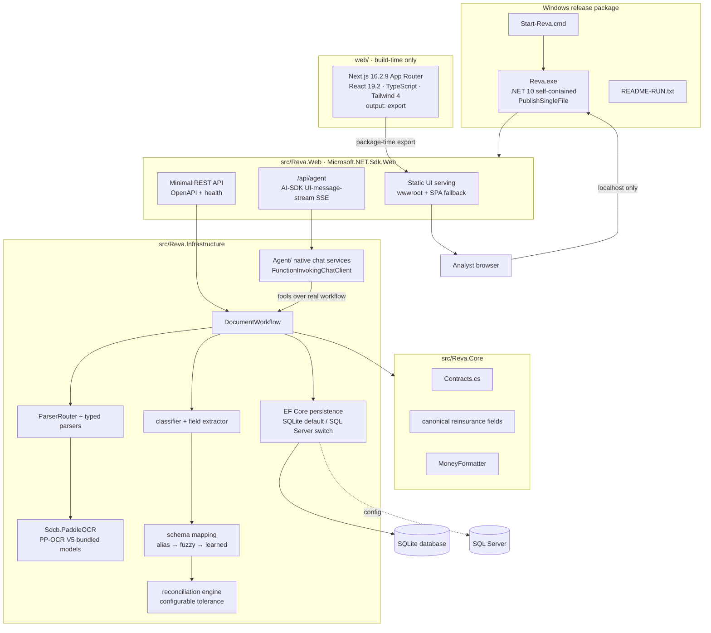
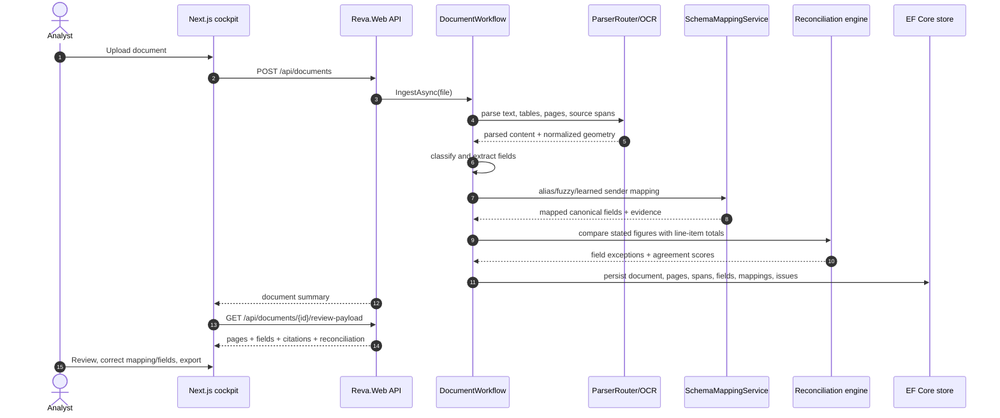

# Architecture

Reva is a local-first document-intelligence application for reinsurance bordereaux ingestion and reconciliation. The production runtime is deliberately simple: one self-contained `Reva.exe` hosts the static cockpit, REST API, OCR, reconciliation engine, and assistant chat on `http://localhost:5187`.

## System overview



## Runtime shape

Reva ships as one self-contained Windows executable:

- `win-x64`, .NET 10, self-contained publish.
- `PublishSingleFile=true` with native libraries self-extracted by the .NET host.
- One process serves the web UI, API, OCR engine, persistence workflow, and native chat endpoint.
- One origin (`http://localhost:5187`) avoids cross-origin setup and keeps the release package easy to smoke-test.
- The static UI is staged into `src/Reva.Web/wwwroot` during packaging; Node.js is not present at run time.

## Project boundaries

| Project | Responsibility | Dependencies |
|:---|:---|:---|
| `src/Reva.Core` | Domain contracts, document states, canonical reinsurance field names, review payload types, and the single `MoneyFormatter`. | No web or infrastructure dependencies. |
| `src/Reva.Infrastructure` | EF Core persistence, SQLite/SQL Server provider selection, file storage, SHA-256 hashing, parser routing, typed parsers, OCR, classification, extraction, schema mapping, reconciliation, export, settings, demo data, and `DocumentWorkflow`. | Depends on Core and runtime libraries. |
| `src/Reva.Infrastructure/Agent` | Native assistant chat: AI-SDK request parsing, UI-message-stream SSE mapping, Ollama process management, tool-loop registration, and document/reconciliation/field-explanation tools. | Uses the real workflow and review payload assembler. |
| `src/Reva.Web` | Minimal API host, `/api/agent`, `/api/agent/status`, OpenAPI, static file serving, SPA fallback, and package health. | Depends on Core and Infrastructure. |
| `web/` | Next.js 16.2.9 static cockpit. Built with `pnpm` at package time and exported to `wwwroot`. | Build-time Node.js only. |

## API surface

| Route | Purpose |
|:---|:---|
| `POST /api/documents` | Upload a document and run ingestion. |
| `GET /api/documents` | Return the work queue. |
| `GET /api/documents/{id}` | Return document detail. |
| `GET /api/documents/{id}/review-payload` | Return the schema-backed split-view review payload. |
| `GET /api/documents/{id}/pages/{page}.png` | Return a page image for review and citation overlays. |
| `POST /api/documents/{id}/review` | Save field edits and mapping corrections. |
| `GET /api/documents/{id}/export` | Export the document with a selected format/template. |
| `/api/templates` | Create, read, update, duplicate, and delete export templates. |
| `POST /api/data/reseed` / `POST /api/data/clear` | Manage local demo/workspace data. |
| `POST /api/agent` | Stream native assistant responses as AI-SDK UI-message-stream SSE. |
| `GET /api/agent/status` | Report Ollama process/model availability. |
| `GET /health` | Package and host health check. |

## Data flow



## Persistence and configuration

SQLite is the offline default. SQL Server is selected by configuration when a shared database is needed:

```json
{
  "Reva": {
    "Database": {
      "Provider": "SqlServer",
      "ConnectionString": "Server=.;Database=Reva;Trusted_Connection=True;TrustServerCertificate=True"
    }
  }
}
```

Settings stored in the app include theme/accent/branding, confidence thresholds, reconciliation tolerance, optional LLM-assisted extraction, default export template, and data-management actions.

## Review payload and citations

Review payloads follow [`contracts/bdx-review-payload.schema.json`](../contracts/bdx-review-payload.schema.json). Source geometry is normalized to `0..1` against the final rendered page size. OCR and rendered PDF pages can carry exact boxes and polygons; purely textual or fallback parses still include provenance even when geometry is unavailable.

The split-view cockpit uses this contract to keep field panels, exception cards, and document highlights synchronized. A corrected field is marked **Reviewed** rather than having its confidence inflated.

## Security posture

- Localhost-only runtime; no external service is required for core extraction.
- Uploads are stored under safe names and hashed with SHA-256.
- Unknown files degrade to visible-text fallback instead of crashing the workflow.
- Optional Docling and optional LLM-assisted extraction stay disabled unless configured.
- Secrets come from environment or local configuration and are never part of the repository.
