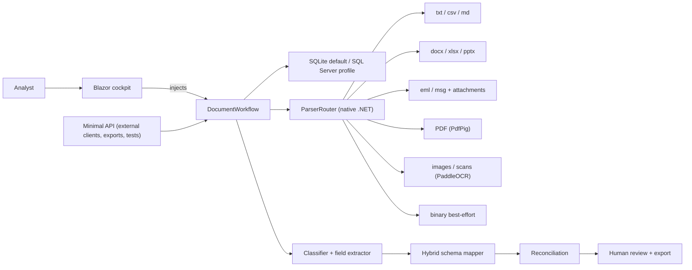

# Architecture

Reve Intelligence is a backend-first Blazor Web App for reinsurance document operations. One
workflow owns the whole path: ingest a document, parse it, classify it, map each sender's
headers to the canonical schema, extract canonical fields, reconcile stated figures against
the line items, let an analyst review and correct, then export. There is one code path and it
is easy to follow end to end.

## System shape



## Boundaries

- `src/Reva.Core` — domain contracts (`Contracts.cs`), document states, reinsurance field
  names, and the single `MoneyFormatter`. No dependencies on the web or infrastructure layers.
- `src/Reva.Infrastructure` — EF Core persistence, file storage, hashing, the `ParserRouter`
  and typed parsers, the PaddleOCR engine, classification, extraction, learned schema mapping,
  reconciliation, and `DocumentWorkflow` orchestration.
- `src/Reva.Web` — the Blazor cockpit (which injects `IDocumentWorkflow` directly) and the
  Minimal API. `Branding.cs` owns the product name; `Formatting`/`MoneyFormatter` is reused
  from Core so money renders identically on every surface.

The UI does **not** call its own HTTP API. The Minimal API stays for external clients, the
export download URLs, and the integration tests.

## Never hard-reject

Any input is ingested. Unknown or hostile files fall back to a best-effort, low-confidence
record instead of an error. Operational limits (size, zip-bomb) are the only gate.

## Reconciliation engine

When a document both **states** headline figures (e.g. a broker cover note: `Premium: USD
4,400,000`) and carries the **line items** as a table, the extractor compares them:

- Money fields (premium, claims, commission) — stated value vs the summed column total.
- Cession rate — stated rate vs the line-item rate.
- Line of business — stated text vs the line-item value (token overlap).

Each disagreement becomes a field-level exception carrying the field, the **Detected** (stated)
value, the **Expected** (computed) value, and an agreement score in `[0,1]`. A perfect match
produces no exception. Every figure and score is computed from the document — nothing is
hardcoded. This is what the cockpit's exception cards render.

## Database

SQLite is the default so the repo runs with no infrastructure, via EF Core migrations. SQL
Server is selected by configuration:

```json
{
  "Reva": {
    "Database": {
      "Provider": "SqlServer",
      "ConnectionString": "Server=.;Database=Reva;Trusted_Connection=True;TrustServerCertificate=True"
    }
  }
}
```

## Confidence is honest

Field confidence is computed from how the value was located blended with a domain validation
check — never a fixed constant. A field an analyst corrects is shown as **Reviewed** rather
than an inflated AI score, because a human set it.

Schema-mapping confidence is tracked separately. Cold-start mappings come from canonical
reinsurance synonyms plus bounded fuzzy matching; analyst corrections persist as learned
sender/domain overrides in EF and take precedence for the next document from that sender.

## Security and data handling

The repo ships only synthetic samples. Do not commit real customer documents, recruiter
emails, personal IDs, CVs, or credentials.
