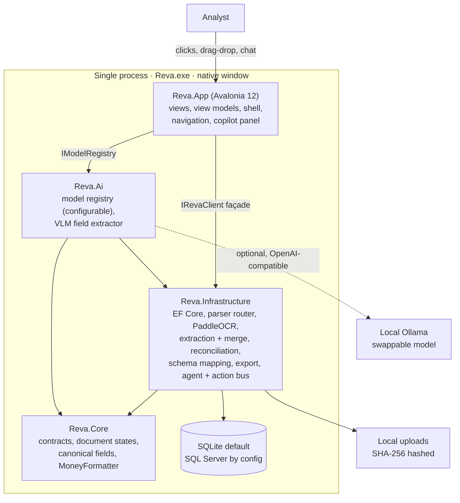
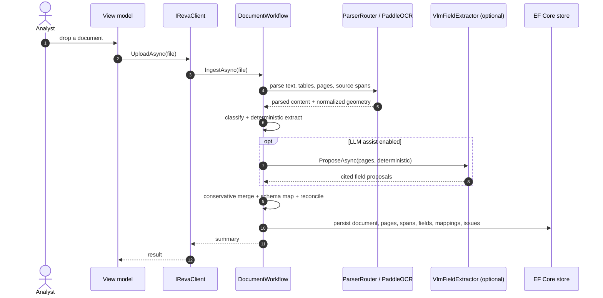
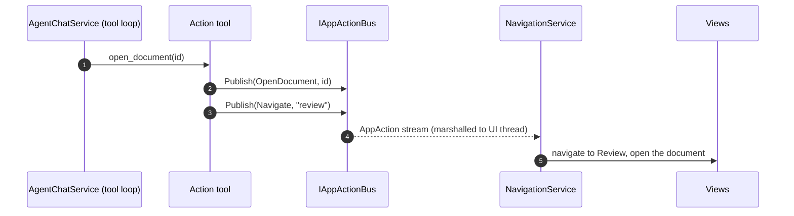

# Architecture

Reva 2.0 is a native desktop application for reinsurance bordereaux ingestion and reconciliation. The whole product runs in one process: the Avalonia UI, the document pipeline, the database, the OCR engine, and the AI copilot all call each other through in-process dependency injection. There is no web server and no HTTP between the layers.

> The earlier release served a Next.js cockpit over `http://localhost:5187`. That browser host (`src/Reva.Web`) is retained in the repository but is not part of the 2.0 product. Everything below describes the native app, `src/Reva.App`.

## System overview



## Runtime shape

- A native Avalonia window, not a browser. Launching `Reva.exe` opens the app directly — no URL, no port, no SPA.
- One process hosts the UI, the workflow, EF Core, PaddleOCR, and the agent. They communicate by method calls, not network requests.
- The workspace is per-user: the SQLite database and the uploads folder live under `%LOCALAPPDATA%\Reva`.
- The AI is local and optional. When Ollama is absent, every non-AI feature works unchanged.

## Project boundaries

Dependencies point inward. The app depends on infrastructure and AI; infrastructure and AI depend on core; core depends on nothing.

| Project | Responsibility | Depends on |
|:---|:---|:---|
| `src/Reva.Core` | Domain contracts, document and review states, canonical reinsurance field names, and `MoneyFormatter`. | Nothing. |
| `src/Reva.Infrastructure` | EF Core persistence and provider selection, file storage, SHA-256 hashing, parser routing and typed parsers, PaddleOCR, classification, deterministic extraction, the VLM merge seam, schema mapping, reconciliation, export, settings, data maintenance, the agent chat service, and the in-process action bus. | Core. |
| `src/Reva.Ai` | The configurable model registry and the VLM field extractor. Implements the infrastructure's `ILlmFieldExtractor`. | Core, Infrastructure. |
| `src/Reva.App` | The Avalonia desktop application — the shipped `Reva.exe`. Views, view models, navigation, the copilot panel, theming, and DI composition. | Core, Infrastructure, Ai. |
| `src/Reva.Web` | Legacy browser host. Retained, not shipped in 2.0. | Core, Infrastructure. |

## Composition

The app has one composition root: `AppServices.Build()` in `src/Reva.App/Composition/`. It ensures the per-user data directory exists, builds configuration (forcing the SQLite provider at the per-user path and the per-user upload root), then registers everything:

```csharp
services.AddRevaInfrastructure(configuration);   // pipeline, agent, action bus, EF Core
services.AddRevaAi(configuration);               // model registry, VLM extractor
services.AddSingleton<IRevaClient, RevaClient>();
services.AddSingleton<INavigationService, NavigationService>();
// + ShellViewModel and every screen's view model
```

`AddRevaInfrastructure` and `AddRevaAi` are the same extension methods the backend exposes, so the desktop app re-hosts the proven domain core rather than reimplementing it.

## How the layers talk

The UI never calls infrastructure services directly. Every view model takes one façade, `IRevaClient`, which opens a DI scope per call and forwards to the workflow, template store, exporter, settings store, and model registry. This keeps view models free of infrastructure detail and gives one seam to mock in tests.



## The copilot action bus

The copilot can move the real UI without reaching into views. Its action tools publish typed `AppAction` messages onto an in-process `IAppActionBus` (`src/Reva.Infrastructure/Agent/AppAction.cs`). The app's `NavigationService` subscribes to that bus and performs the navigation on the UI thread. Chat and UI share one channel, so they stay in lockstep.



The action kinds are fixed and small: `Navigate`, `OpenDocument`, `GotoPage`, `Highlight`, `Refresh`, `SetFilter`, `Toast`, `Progress`.

## Persistence and configuration

SQLite is the default and needs no setup — the database is one file under the user's local app data. SQL Server is selected by configuration when a team needs shared storage; the registration picks the provider at startup with no code change:

```json
{
  "Reva": {
    "Database": {
      "Provider": "SqlServer",
      "ConnectionString": "Server=.;Database=Reva;Trusted_Connection=True;TrustServerCertificate=True"
    }
  }
}
```

The AI layer is configured under `Reva:Ai:*` (base URL, active model, vision toggle, timeout) and the model registry persists the chosen model to a state file in the workspace. In-app settings cover theme, accent, branding, confidence thresholds, reconciliation tolerance, the LLM-assist toggle, the default export template, the model menu, and data management.

## Review payload and citations

Review payloads follow [`contracts/bdx-review-payload.schema.json`](../contracts/bdx-review-payload.schema.json). Source geometry is normalized to `0..1` against the final rendered page size. OCR and rendered PDF pages carry exact boxes and polygons; purely textual or fallback parses still include provenance even when geometry is unavailable. A corrected field is marked **Reviewed** rather than having its confidence inflated.

## Security posture

- Fully local: OCR, the database, and the model all run on-device. No external service is required for core extraction.
- Uploads are stored under safe names and hashed with SHA-256.
- Unknown files degrade to a low-confidence visible-text record instead of crashing the workflow.
- The VLM and Docling paths stay disabled unless explicitly configured, and a model proposal can never overwrite a validated figure.
- Secrets come from environment or local configuration and are never committed.
