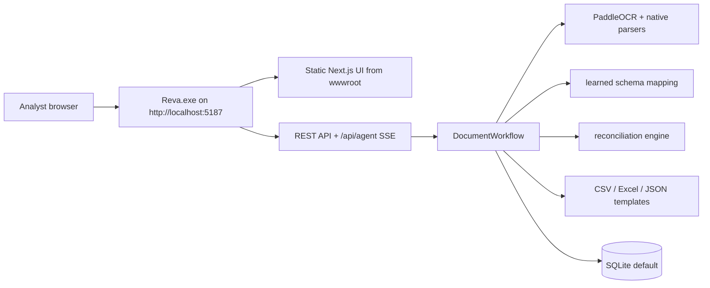

# Reva documentation

  
  
<strong>Production docs for Reva 1.3.0 — local-first document intelligence for reinsurance bordereaux.</strong>

## Start here

| Guide | Scope |
|:---|:---|
| [Architecture](architecture.md) | The single `Reva.exe`, .NET 10 host, static Next.js cockpit, API surface, persistence, and runtime boundaries. |
| [AI pipeline](ai-pipeline.md) | Parser routing, offline OCR, extraction, confidence, learned mapping, reconciliation, assistant chat, and export. |
| [Packaging](packaging.md) | Windows package contents, build command, release ZIP shape, and smoke-test checks. |
| [Demo script](demo-script.md) | A short product walkthrough using the seeded corpus and real review/export flows. |
| [Reinsurance landscape](research/reinsurance-landscape.md) | Domain grounding: document types, canonical fields, standards, reconciliation breaks, and competitive UX patterns. |
| [Test suite](../tests/index.md) | Unit, integration, host smoke, package smoke, web Playwright, accessibility, and optional Docling-worker tests. |

## Current product contract

Reva is a local-first, offline-by-default AI document-intelligence application for reinsurance bordereaux ingestion and reconciliation. The product name is **Reva**; the in-app cockpit title is **Reve Intelligence**.

At runtime, Reva is one localhost-only Windows process:

## Non-goals and boundaries

- Node.js is build-time only; no Node process is required in the release package.
- Python and Docling are optional richer parsing paths, not core runtime requirements.
- The inbound email seam is file-based `.eml`/`.msg`; live mailbox sync is not a shipped feature.
- Extraction stays deterministic and keyless unless optional LLM-assisted extraction is explicitly enabled.
- Bounding boxes are normalized to `0..1` against the final rendered page size.
- Provenance is always present; citations may be empty only when geometry is unavailable.
