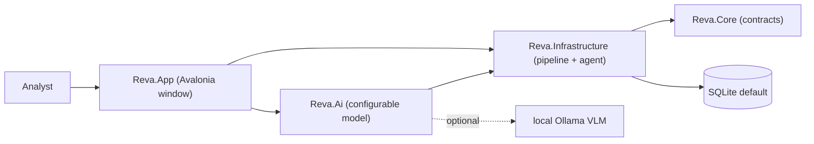

# Reva documentation

Local-first document intelligence for reinsurance bordereaux, shipped as a native Avalonia desktop application.

## Start here

| Guide | One line |
|:---|:---|
| [Architecture](architecture.md) | The four in-process projects, the native window, the layer boundaries, and the copilot action bus. |
| [AI pipeline](ai-pipeline.md) | Parsing, offline OCR, deterministic extraction, the VLM merge, reconciliation, schema mapping, and the agent. |
| [Packaging](packaging.md) | How the native single-file `Reva.exe` is built and run. |

## Learn the codebase (interview-ready)

| Guide | One line |
|:---|:---|
| [Code tour](learn/code-tour.md) | A file-by-file walk through every project and key file, written to teach. |
| [Tech stack](learn/tech-stack.md) | Why .NET 10, Avalonia, MVVM, EF Core, PaddleOCR, Ollama, and Skia — with how-to-explain talking points. |
| [Interview cheatsheet](learn/interview-cheatsheet.md) | Likely questions with crisp answers, the elevator pitch, and a live demo script. |
| [Model landscape](learn/model-landscape.md) | The June-2026 local LLM/VLM/OCR map and why the model is user-selectable, not hardcoded. |

## Domain and reference

| Guide | One line |
|:---|:---|
| [Glossary (CONTEXT.md)](../CONTEXT.md) | The reinsurance and architecture terms used throughout Reva, defined once. |
| [Reinsurance landscape](research/reinsurance-landscape.md) | Document types, canonical fields, standards, and reconciliation breaks behind the product. |

## The product in one diagram

Everything runs in one process; layers depend inward and there is no HTTP between them.

## Boundaries

- The native desktop app is the 2.0 product. The legacy browser host in `src/Reva.Web` is retained but is not part of the shipped app.
- The deterministic tier — native parsers, offline OCR, extraction, reconciliation — runs with no model and no network.
- The local VLM is optional and chosen in Settings. Docling is an optional richer parsing path, off by default.
- Citation geometry is normalized to `0..1` against the rendered page size; provenance is always present even when geometry is unavailable.
