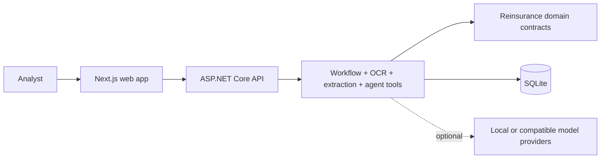

# Reva docs

Reva is a reinsurance document-intelligence web app. It ingests operational documents, extracts source-cited fields, reconciles totals, lets analysts review exceptions, and exports clean data.

## Start here

| Page | Use it for |
|:---|:---|
| [README](../README.md) | Product overview, stack, quick start, architecture diagram. |
| [Architecture](architecture.md) | Web frontend, API, domain core, infrastructure, storage, and provider seams. |
| [AI pipeline](ai-pipeline.md) | Deterministic path, optional model assist, agent tool loop, and provider choices. |
| [Demo script](demo-script.md) | A short walkthrough for upload, review, copilot, Knowledge Hub, and export. |
| [Packaging](packaging.md) | Build and run shape for the API-hosted static web app. |

## Learn

| Page | Use it for |
|:---|:---|
| [Interview cheatsheet](learn/interview-cheatsheet.md) | Elevator pitch, Q&A, and demo script. |
| [Code tour](learn/code-tour.md) | Where each project fits. |
| [Tech stack](learn/tech-stack.md) | How to explain each technology choice. |
| [Model landscape](learn/model-landscape.md) | Local and provider-backed model options. |

## Research

| Page | Use it for |
|:---|:---|
| [Reinsurance landscape](research/reinsurance-landscape.md) | Domain, document types, reconciliation breaks, and competitive patterns. |

## Product constraints

- The deterministic path must work without keys, network access, or model providers.
- AI features are optional and settings-driven.
- Every field carries provenance.
- Geometry-backed citations use normalized coordinates.
- The web app is the product surface; docs should not describe retired UI shells.
