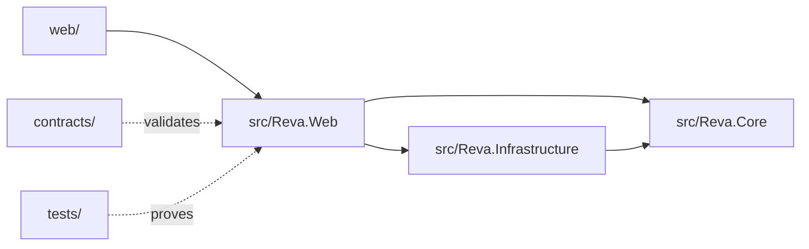

# Code tour

Reva is split by responsibility: product UI, API surface, domain contracts, infrastructure machinery, schemas, and tests.

## `web/`

The product frontend. It contains the app shell, workspace, review screen, mappings, export, settings, Knowledge Hub, and copilot. The API client contract lives in `web/lib/api/client.ts`. Keep backend shapes aligned with that file.

## `src/Reva.Web`

The ASP.NET Core host. It maps feature endpoint groups, handles uploads, exposes review payloads, streams processing events, hosts agent chat, serves Knowledge Hub endpoints, and serves the static frontend build in production.

Key idea: endpoint groups are mapped once. Duplicate route registration can create ambiguous matches, so add endpoints inside the existing group for that feature.

## `src/Reva.Core`

The domain vocabulary. It owns document states, canonical reinsurance fields, shared contracts, and value formatting. It should not depend on UI or persistence details.

## `src/Reva.Infrastructure`

The machinery. It owns:

- EF Core records and migrations
- file storage and hashing
- parser routing
- PaddleOCR integration
- deterministic extraction
- optional model-assist adapters
- schema mapping
- reconciliation
- export templates
- settings
- Knowledge Hub
- agent tools

`DocumentWorkflow` is the pipeline spine.

## `contracts/`

Schema files for payloads that must stay stable. Review payload geometry uses normalized coordinates so the browser can render highlights at any zoom.

## `tests/`

Unit tests cover domain and infrastructure behavior. Integration tests prove API flows against real services and persistence. End-to-end tests are separate and only touched when explicitly scoped.

## One upload, end to end

1. The frontend posts a file through the centralized API client.
2. The API stores it and calls the document workflow.
3. Infrastructure routes the format, runs OCR if needed, extracts fields, maps headers, reconciles totals, and persists results.
4. The API returns a review payload with fields, citations, issues, and actions.
5. The frontend renders review state and lets the analyst correct values.
6. The agent can call backend tools over the same stored document.
