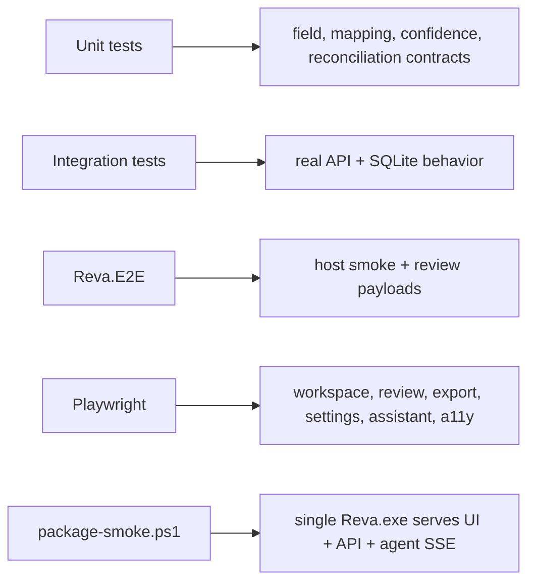

# Test suite

Reva's tests cover the local-first backend, the real API with SQLite, the packaged host, the static Next.js cockpit, accessibility, and optional Docling-worker paths.

## Test map

| Suite | Covers | Run |
|:---|:---|:---|
| [Reva.Unit](Reva.Unit/) | Domain formatting, classifier behavior, extraction confidence, reconciliation including tolerance, parser seams, LLM extraction options, schema mapping aliases, learned overrides, and unmapped behavior. | `dotnet test tests/Reva.Unit/Reva.Unit.csproj` |
| [Reva.Integration](Reva.Integration/) | Real API host + SQLite flows: upload, parse, classify, schema-map, review decisions, settings, exports, inbound-source status, and schema-valid payloads. | `dotnet test tests/Reva.Integration/Reva.Integration.csproj` |
| [Reva.E2E](Reva.E2E/) | API host smoke coverage and review payload contracts outside the solution's main test projects. | `dotnet test tests/Reva.E2E/Reva.E2E.csproj --no-build` |
| [web/tests/e2e](../web/tests/e2e/) | Playwright coverage for workspace, review citation hover, export templates, settings, onboarding, assistant chat, and axe accessibility checks against the live stack. | `cd web && npx playwright test` |
| [package-smoke.ps1](package-smoke.ps1) | Builds the Windows package, extracts it, starts `Reva.exe`, checks `/health`, `/api/documents/`, `/`, `/api/agent/status`, and `POST /api/agent` SSE. | `./tests/package-smoke.ps1` |
| [docling-worker](../tools/docling-worker/tests/) | Optional Python Docling-worker text and CSV behavior. Not required for the default offline runtime. | `python -m unittest discover tools/docling-worker/tests` |

## Recommended validation order

```powershell
dotnet build Reva.slnx -warnaserror
dotnet test Reva.slnx
dotnet build tests/Reva.E2E/Reva.E2E.csproj
dotnet test tests/Reva.E2E/Reva.E2E.csproj --no-build
cd web
npx playwright test
```

Package validation:

```powershell
./tests/package-smoke.ps1
```

## What good coverage proves



A green package smoke is the strongest release-surface proof because it verifies the same all-in-one executable shape that users run.
